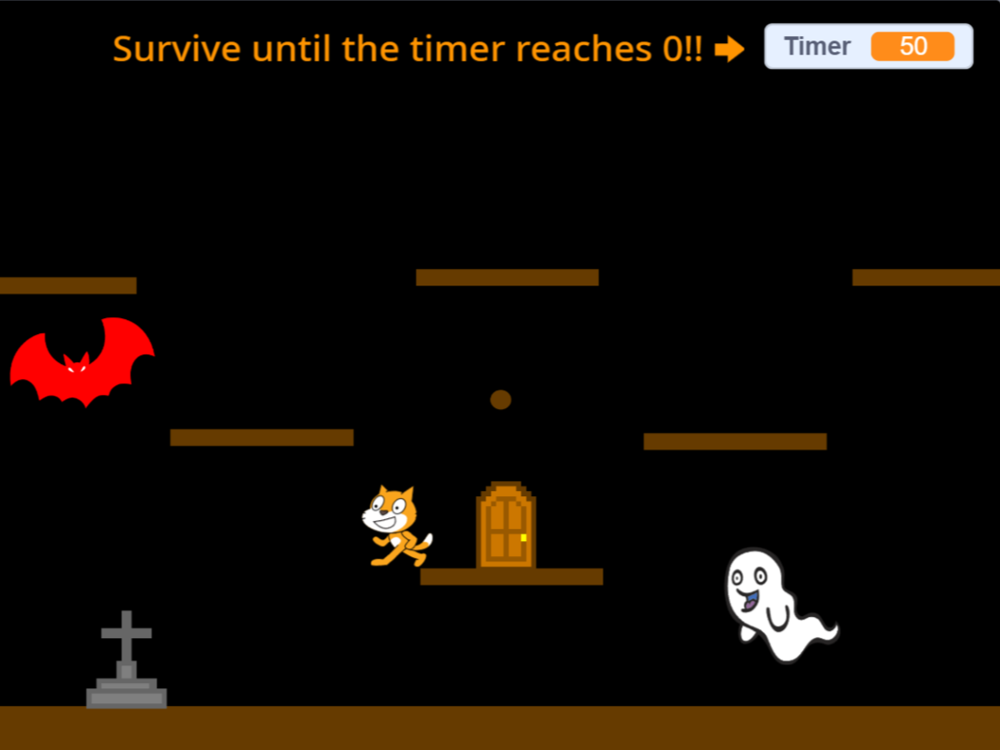

# ゴーストエスケープ（Ghost Escape）for Scratch

「ゴーストエスケープ」は、ゴーストや舞い散るコウモリから逃げ回り、60秒間生き残ることを目指すシンプルで楽しいゲームです。

## 使い方

1. ゲームを開始すると、プレイヤーのキャラクターがゴーストたちの出没する世界に登場します。
2. キーボードの矢印キーを使用して、キャラクターを巧妙に動かしてゴーストやコウモリから逃げまわります。
3. ゴーストやコウモリに接触すると、貴重な時間が失われますので注意が必要です。
4. 60秒経過でゲームクリア！敵に接触してしまうとゲームオーバーとなります。
5. 
## プレビュー

## 注意

- ゴーストやコウモリをうまくかわして、最大限の生存時間を目指しましょう。
- 操作は簡単なので、どなたでも気軽に楽しめます。

## ライセンス

[MIT ライセンス](LICENSE)

---

**逃げ回りながらゴーストたちをかわし、60秒間の生存を果たそう！**

